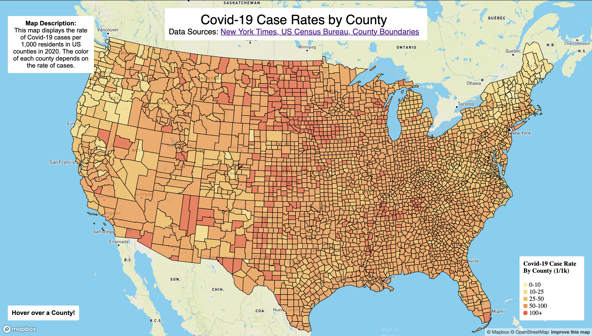
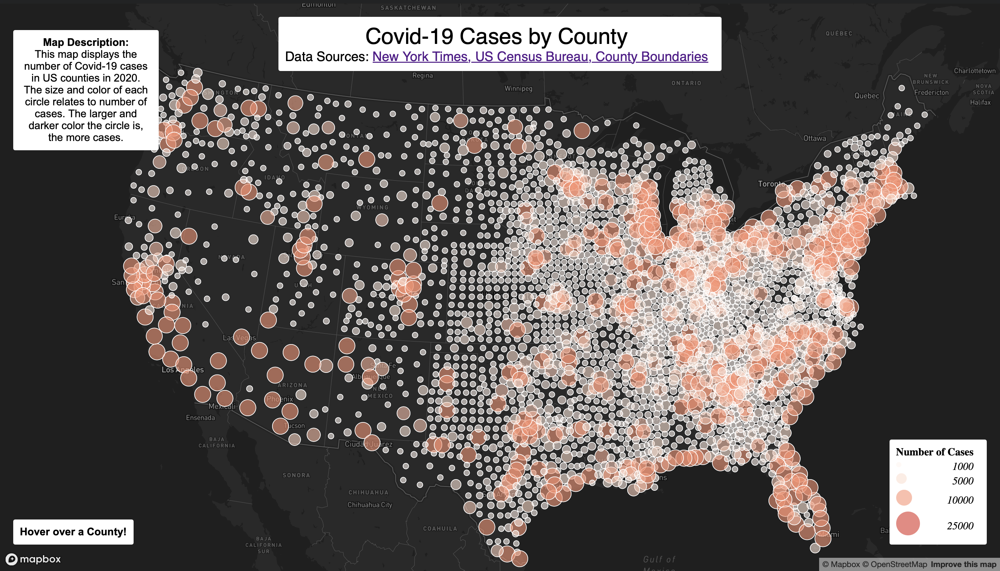

# GEOG 458 Covid-19 Maps
AI Disclosure:
No AI tools were used in this assignment.

Description:
The Maps in this repository are a visulization of the number of Covid-19 Cases by County around the United States in 2020. The project utilizes per county case data from the New York Times and county boundry/population data from the US Census Bureau. Map One is a choropleth map showing the rate of cases in each county (per 1000 residents). Map Two is a proportional map representing the total number of cases in each county.

Links:
[Map One](https://sirwillphil.github.io/CovidMapGEOG458/map1)
[Map Two](https://sirwillphil.github.io/CovidMapGEOG458/map2)

Screenshots:

Functions:
Both maps primarily use the Mapbox GL JS library. In both maps I used a hover function to show the number of cases when you hover over a county. 

Sources:
[New York Times](https://github.com/nytimes/covid-19-data/blob/43d32dde2f87bd4dafbb7d23f5d9e878124018b8/live/us-counties.csv)
[US Census Bureau](https://data.census.gov/table/ACSDP5Y2018.DP05?g=0100000US$050000&d=ACS+5-Year+Estimates+Data+Profiles&hidePreview=true)
[County Boundaries](https://www.census.gov/geographies/mapping-files/time-series/geo/carto-boundary-file.html)
